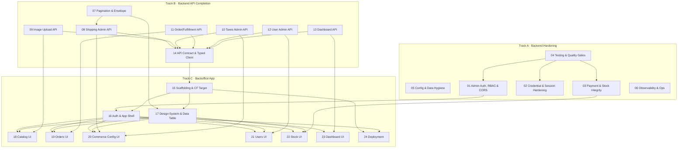

# Invern Spirit — Backend Completion & Backoffice Implementation Plan

> Plan generated 2026-07-02 against `invern-be` @ commit `60c9708` (branch `preview`).
> Repo: `/Users/manuelfesantos/personal-projects/invern-be` — **to be renamed `invern-spirit`** and grown into the single monorepo for all Invern apps (backend, storefront, backoffice, and any standalone workers), mirroring the `7-30` layout (`apps/*` + `packages/*`, one shared `turbo.json` and one `.github/workflows/` pipeline). The backoffice is a **new app inside this repo (`apps/backoffice`)**, not a separate repository — see [Assumptions](#assumptions--single-source-of-truth-values).
> This plan is documentation only — no application code was changed to produce it.

## Purpose & scope

Invern Spirit is a pre-launch e-commerce platform. Today the backend lives in `invern-be` (a Workers + Hono app already structured as a small monorepo — `apps/backend` + `libs/*`) running on Cloudflare with D1, KV, R2, Stripe, Brevo and Google OAuth; the storefront and any other services live in their own repos. This plan coordinates **three tracks of work** to get it launch-ready *and* give non-technical staff a way to run it. The end-state is a **single `invern-spirit` monorepo** that houses every Invern app (backend, storefront, backoffice, workers) under `apps/*` with shared `packages/*`, a shared `turbo` task graph, and one GitHub Actions pipeline (a shared PR gate + per-app deploy workflows), following the `7-30` model:

- **(A) Backend Hardening** — fix verified security, concurrency, testing and configuration gaps so the API is genuinely production-ready.
- **(B) Backend API Completion** — extend the admin (`/private/*`) surface so a real backoffice can be built against it: missing endpoints (shipping, images, taxes, fulfillment status), consistent pagination/filtering, real authentication and role enforcement, an operational summary endpoint, and a complete, generated-client-ready OpenAPI contract.
- **(C) Backoffice Application** — a new React + Cloudflare app **inside the monorepo (`apps/backoffice`)**, styled with Tailwind, that manages **every** backend entity (catalog, orders, users, and all commerce configuration) end-to-end through a UI, deployed on Cloudflare from the shared pipeline to a high engineering standard.

The three tracks are linked: most backoffice screens cannot be built until the backend exposes the data and actions they need, and the backend's admin surface exists only to serve this app. Those dependencies are made explicit in every feature README and in the [dependency graph](#execution-phases--dependency-order) below.

**Explicitly excluded:** new customer/shopper-facing commerce features. This program completes the platform's operational/admin side; it does not add storefront functionality. See [Explicitly out of scope](#explicitly-out-of-scope).

## How to use this plan

1. Start from the [Feature index](#feature-index). Pick the next **unblocked** feature in priority order (respect the `Depends on` column and the [phase plan](#execution-phases--dependency-order)).
2. Open that feature's `README.md`, then read the full step file **before** starting any step — each step file is self-contained and assumes zero prior context.
3. Update the step's `status` (in both the YAML front-matter and the `**Status:**` line) as you go: `Not Started → In Progress → Done` (or `Blocked`, with a reason noted in the step body).
4. When every step in a feature is `Done`, update the feature README's status line and the corresponding row in the [Feature index](#feature-index).
5. Each step is scoped to roughly one focused implementation session (a few hours to ~2 days) and should land as one coherent, reviewable PR.

## Status legend

| Status | Meaning |
|---|---|
| Not Started | No work has begun |
| In Progress | Actively being worked on |
| Blocked | Cannot proceed — reason noted in the step file |
| Done | Complete and verified against its acceptance criteria |

## Priority legend

| Priority | Meaning |
|---|---|
| P0 | Must be resolved before production launch |
| P1 | Should be resolved before or shortly after launch |
| P2 | Can follow after launch |

## Track legend

| Track | Meaning |
|---|---|
| Backend Hardening | Correctness/security/ops fixes to the existing `invern-be` API |
| Backend API Completion | New/extended `/private/*` API surface required to power the backoffice |
| Backoffice App | The new backoffice React app at `apps/backoffice` in the `invern-spirit` monorepo |

## Feature index

| # | Feature | Track | Priority | Status | Summary |
|---|---|---|---|---|---|
| 01 | [Admin Authentication, RBAC & CORS](./01-admin-auth-rbac-cors/README.md) | Backend Hardening | P0 | Done | Real auth + `ADMIN` role enforcement on every `/private/*` route, role claim in the JWT, and a deliberate CORS policy for both frontends. Hard blocker for the backoffice login. |
| 02 | [Credential & Session Hardening](./02-credential-session-hardening/README.md) | Backend Hardening | P0 | Done | Replace single-round SHA-256 password hashing with a real KDF; add refresh-token expiry + revocation on logout; stop AES-GCM fixed-IV reuse; add login rate limiting. |
| 03 | [Payment & Stock Integrity](./03-payment-stock-integrity/README.md) | Backend Hardening | P0 | Done | Fix the R2 lock first-acquire race and its format bug; keep D1/KV/R2 stock in sync (incl. the product-edit desync); verify webhook idempotency. |
| 04 | [Testing & Quality Gates](./04-testing-quality-gates/README.md) | Backend Hardening | P0 | Done | Stand up the first real Jest suites on the riskiest paths and make `validate-pr-to-main` actually run lint/test/typecheck. Foundational — sequence early and in parallel. |
| 05 | [Configuration & Data Hygiene](./05-configuration-data-hygiene/README.md) | Backend Hardening | P0 | Done | Rewrite the drifted `.env.example`, remove dead Turso/`COUNTRIES_BUCKET` config, rename the mislabeled "sendgrid" (→ Brevo) adapter, and remediate `npm audit` findings. |
| 06 | [Observability & Operational Readiness](./06-observability-ops-readiness/README.md) | Backend Hardening | P1 | Not Started | Health/readiness endpoint, a Honeycomb-coverage + PII-redaction review, and a written deploy/rollback runbook. |
| 07 | [Pagination, Filtering & Response Envelope](./07-pagination-filtering-envelope/README.md) | Backend API Completion | P0 | Done | One consistent paginated-response envelope applied uniformly, orders pagination finished, fetch-all list endpoints paginated, and a standard filter/sort query contract. |
| 08 | [Shipping Admin Endpoints](./08-shipping-admin-endpoints/README.md) | Backend API Completion | P0 | Done | Wire the already-existing shipping DB layer into admin use-cases and new `/private/shipping/*` routes for methods, rates and rate-to-country assignment. |
| 09 | [Image Management & Upload](./09-image-management-upload/README.md) | Backend API Completion | P0 | Done | A real R2-backed upload flow plus `/private/images` CRUD and product/collection association — there is no image upload anywhere today. |
| 10 | [Taxes Admin Surface](./10-taxes-admin-surface/README.md) | Backend API Completion | P1 | Not Started | Give taxes a first-class `/private/taxes` surface (they are unmanageable today) over the existing but unused tax DB layer, and fix rate storage. |
| 11 | [Order & Fulfillment Endpoint Improvements](./11-order-fulfillment-endpoints/README.md) | Backend API Completion | P0 | Done | Fix the mislabeled order-update response, and add a use-case + route to set shipping-transaction status and tracking URL. |
| 12 | [User Admin Actions](./12-user-admin-actions/README.md) | Backend API Completion | P1 | Not Started | Decide and implement the admin user-management scope: full detail, role change, mark-validated, disable/enable (delete already exists). |
| 13 | [Admin Dashboard / Summary Endpoint](./13-admin-dashboard-endpoint/README.md) | Backend API Completion | P1 | Not Started | One lightweight operational aggregate endpoint (counts, low-stock, recent orders) for the backoffice home screen. |
| 14 | [API Contract & Typed Client](./14-api-contract-typed-client/README.md) | Backend API Completion | P0 | In Progress | Keep `swagger.yaml` authoritative as endpoints land, add a CI check that the spec is current, and generate a typed client as an in-repo workspace package (`packages/api-client`) the backoffice imports directly. |
| 15 | [Backoffice Scaffolding, Tooling & Cloudflare Target](./15-backoffice-scaffolding/README.md) | Backoffice App | P0 | Not Started | New `apps/backoffice` in the monorepo: Vite + React + TS (strict) + Tailwind, wired into the shared workspaces/turbo/CI, a Cloudflare deploy target, and typed-client (workspace dep) + TanStack Query wiring. |
| 16 | [Auth & Application Shell](./16-backoffice-auth-shell/README.md) | Backoffice App | P0 | Not Started | Admin login against the JWT flow, `ADMIN`-gated protected routing with refresh handling, and the nav/layout shell that hosts every screen. |
| 17 | [Shared Design System & Data-Table Layer](./17-backoffice-design-system/README.md) | Backoffice App | P0 | Not Started | An owned (shadcn-style) component library — table, form fields, modal, toast, loading/empty/error states — reused by every entity screen, plus the TanStack Table layer bound to the pagination envelope. |
| 18 | [Catalog Management](./18-backoffice-catalog/README.md) | Backoffice App | P1 | Not Started | Products list + create/edit, collections management, and the image-upload UI. |
| 19 | [Orders & Fulfillment UI](./19-backoffice-orders/README.md) | Backoffice App | P1 | Not Started | Orders list, order detail, and fulfillment actions (mark shipped/delivered + tracking, cancel). |
| 20 | [Commerce Configuration UI](./20-backoffice-commerce-config/README.md) | Backoffice App | P1 | Not Started | Screens for countries, currencies, taxes, and shipping methods/rates. |
| 21 | [User / Customer Management UI](./21-backoffice-users/README.md) | Backoffice App | P1 | Not Started | User list/detail plus the admin actions defined in feature 12. |
| 22 | [Stock Management UI](./22-backoffice-stock/README.md) | Backoffice App | P1 | Not Started | Stock overview + low-stock view and a safe adjust-stock form that writes through the correct tri-store path. |
| 23 | [Dashboard / Home Screen](./23-backoffice-dashboard/README.md) | Backoffice App | P2 | Not Started | The operational home screen backed by the summary endpoint (feature 13). |
| 24 | [Backoffice Deployment & Environments](./24-backoffice-deployment/README.md) | Backoffice App | P1 | Not Started | A per-app deploy workflow in the monorepo's shared `.github/workflows/` (path-filtered on `apps/backoffice`), preview-per-PR + production environments, custom domain, secrets, and a release runbook with E2E smoke tests. |

**Totals:** 24 features — 6 Backend Hardening, 8 Backend API Completion, 10 Backoffice App. 78 steps.

## Execution phases / dependency order

Numbering (`NN-slug`) is filesystem sort order only — **not** execution order. Execution is governed by each step's `depends_on` field and the phases below.

- **Phase 0 — Backend foundations (all P0, run in parallel).** `04` (testing scaffolding), `05` (config/env hygiene), `01` (admin auth/RBAC/CORS), `02` (credential hardening), `03` (payment/stock integrity), `07` (pagination envelope). These are the launch-blocking safety fixes plus the two hard backoffice enablers (auth + pagination). Testing (`04`) is foundational and runs alongside, not last — every other feature's acceptance requires tests, so its Jest scaffolding step must land first.
- **Phase 1 — Backend admin API surface.** P0: `08` (shipping), `09` (images), `11` (order/fulfillment). P1: `10` (taxes), `12` (users), `13` (dashboard). `14` (API contract + typed client) runs continuously through this phase, absorbing each endpoint as it lands and producing the client that Phase 2 consumes.
- **Phase 2 — Backoffice foundation (all P0).** `15` (scaffolding) can start immediately. `16` (auth & shell) needs `01` (RBAC exists server-side) and `14` (typed client). `17` (design system + data table) needs `07` (pagination envelope shape).
- **Phase 3 — Backoffice entity screens (P1).** Each needs its own backend counterpart **plus** `16` + `17`: `18` catalog ← `09`; `19` orders ← `11`; `20` commerce config ← `08` + `10`; `21` users ← `12`; `22` stock ← `03`. These screens are largely independent of each other and can proceed in parallel once the shell and design system exist.
- **Phase 4 — Polish & ship.** `23` (dashboard UI ← `13`), `24` (deployment), and `06` (observability + runbook) land last.

## Corrections to the task brief's "verified findings"

Re-verifying §5/§6 against the code at `60c9708` surfaced several places where the brief is stale or imprecise. These are handled explicitly in the relevant steps rather than followed blindly:

- **Taxes are *not* "bundled into the currency admin flow."** §6 states currency updates call into `libs/adapters/stripe/tax/*`. They do not — `grep -rni "tax\|stripe" libs/modules/currency/` returns nothing; `add-currency.ts` / `update-currency.ts` touch only the currency table. Taxes are seeded **once** via `/private/insert-test-data` (from Stripe tax rates) and the tax DB actions (`libs/db/tax/**`) are otherwise unused. Net effect: taxes are **completely unmanageable through any live endpoint today**, which makes feature 10 more of a from-scratch build than a "decide where to nest it" decision. See [10](./10-taxes-admin-surface/README.md).
- **Pagination is not uniformly absent.** §6 says "No list endpoint supports pagination." In fact `/private/users` and `/private/carts` already paginate (`getAllUsers`/`getAllCarts` → `runBatchOperationWithCount`, returning `{ count, ... }`). `/private/orders` supports pagination in the DB layer (`getSelectOrdersAction` accepts `page`/`pageSize`) but the `getAllOrders` use-case drops those args. `/private/products`, `/collections`, `/countries`, `/currencies` fetch the whole table. So feature 7 is "standardize and finish," not "add from zero." See [07](./07-pagination-filtering-envelope/README.md).
- **Admin user access is not strictly read-only.** §6 says users are "list/detail only." `functions/private/users/[id]/index.ts` also exports a working `onRequestDelete` → `deleteUser`. There is still no *update* path (role, validation). See [12](./12-user-admin-actions/README.md).

## Additional findings (beyond §5/§6, verified this session)

Turned into steps in the features noted:

- **Logout does not revoke the refresh token.** `deleteAuthSecret` (`libs/adapters/kv/auth/auth-secret-client.ts`) exists but is called **nowhere**; `logout.ts` only issues anonymous tokens. A captured refresh token keeps working after logout. → [02](./02-credential-session-hardening/README.md).
- **Refresh tokens never expire.** `getLoggedInRefreshToken` signs `{ userId }` with no `exp` (`libs/utils/jwt/jwt-utils.ts`). → [02](./02-credential-session-hardening/README.md).
- **`users.version` is a no-op for auth.** It is incremented on order creation (`getIncrementUserVersionAction`) but never read during credential verification, so it is not the token-invalidation lever it looks like. → [02](./02-credential-session-hardening/README.md).
- **AES-GCM uses a fixed IV.** `encrypt`/`decrypt` default to `ENV.DEFAULT_IV` (`libs/utils/crypto/encrypt/encryptor.ts`), so JWTs and stored addresses are encrypted deterministically with a reused nonce — a real GCM weakness. → [02](./02-credential-session-hardening/README.md).
- **No rate limiting anywhere.** No login lockout, no throttle on `forgot-password`/`resend-email`. → [02](./02-credential-session-hardening/README.md).
- **The R2 lock has a second bug beyond the race.** First acquire writes `JSON.stringify({ expirationTime })`; the renewal path writes `expirationTime.toString()` (a bare number). Reading always does `JSON.parse(...).expirationTime`, so a renewed lock parses to a number whose `.expirationTime` is `undefined` and is treated as expired. → [03](./03-payment-stock-integrity/README.md).
- **Editing a product desyncs stock.** `insertProductSchema` includes `stock`, so `PUT /private/products/{id}` writes `products.stock` in D1 only, never touching `STOCK_KV`/`STOCK_BUCKET`. Any backoffice "edit product" that changes stock will drift the three stores. → [03](./03-payment-stock-integrity/README.md) and [22](./22-backoffice-stock/README.md).
- **`npm audit`** reports 39 total vulnerabilities (2 critical, 9 high); 20 are in production dependencies (1 critical, 2 high). → [05](./05-configuration-data-hygiene/README.md).

## Explicitly out of scope

New **customer/shopper-facing** commerce features are excluded per the brief (§4). None of the following get plan items:

- PayPal payments (`paymentMethods.type` includes `"paypal"` but nothing implements it — left untouched).
- Product reviews/ratings; coupons/discount codes; wishlists; gift cards/loyalty.
- Shopper returns/refunds workflows.
- Full-text/faceted product search (the existing `?search=` `LIKE` query is left as-is).
- Product variants; multi-warehouse inventory; live FX-rate integration (`rateToEuro` stays manually maintained).

Deliberately excluded during this audit as ambiguous "new feature" work, not "completion":

- **Automated stock reconciliation job** (scheduled sweep that repairs D1/KV/R2 drift). Feature 3 fixes the write paths so drift cannot originate; a periodic reconciler is a follow-up hardening candidate, not launch-blocking.
- **Audit log of admin actions.** Genuinely valuable for a multi-user backoffice, but it is net-new infrastructure. Flagged as a fast-follow in feature 6's notes rather than planned here.
- **Backoffice user management for *staff/admin* accounts** (inviting new admins from the UI). Feature 12 covers acting on existing users incl. role changes; a full admin-invite flow with its own email templates is deferred.

## Open questions for a human

Each is logged where it affects a decision; consolidated here:

1. **Monorepo consolidation — inventory & timing (DECIDED: single monorepo).** The backoffice is a new app **inside this repo** at `apps/backoffice`; there is no separate `invern-bo` repo. `invern-be` will be renamed **`invern-spirit`** and grown into the one monorepo for every Invern app, mirroring `7-30` (`apps/*` + `packages/*`, shared `turbo.json`, one `.github/workflows/`). Still to confirm before the consolidation lands: (a) the exact set of existing repos that migrate in (backend ✓ present; storefront + any standalone workers live on GitHub) and their target `apps/*` names, and (b) the timing of the rename/migration relative to feature 15 (the backoffice can be scaffolded in-repo before the other apps move in). The rename + migration is future execution work; this plan documents the target state only.
2. **Cloudflare hosting model for the SPA.** Plan picks **Workers static assets** (Cloudflare's current recommended path) over Pages; rationale in [15](./15-backoffice-scaffolding/README.md). Confirm, or switch to Pages to mirror how `invern-be` deploys.
3. **Taxes surface shape.** Plan chooses a **standalone `/private/taxes`** surface (the current "nested under currencies" model described in §6 does not actually exist in code). Confirm that matches how staff think about taxes, or ask for country-nested UI. See [10](./10-taxes-admin-surface/README.md).
4. **User admin blast radius.** How much power should the backoffice have over user accounts — role changes? forced validation? account disable? hard delete (already possible)? A product decision that sets the scope of features [12](./12-user-admin-actions/README.md) and [21](./21-backoffice-users/README.md).
5. **Password-hash migration strategy.** Upgrading the KDF (feature 2) must handle existing SHA-256 hashes. Plan proposes lazy rehash-on-login + an algorithm marker; confirm there is no requirement to force a global password reset instead. See [02 step-01](./02-credential-session-hardening/step-01-password-kdf-upgrade.md).
6. **Is Cloudflare Access available/desired** as an extra gate in front of the backoffice origin, on top of app-level RBAC? It would add defense-in-depth for an internal tool. See [16](./16-backoffice-auth-shell/README.md).
7. **CORS allow-list source of truth.** Feature 1 needs the final storefront and backoffice origins for preview and production (env-driven). Confirm the hostnames.

## Assumptions — single source of truth values

Correct these here first if wrong; steps reference them rather than hard-coding.

| Value | Assumption | Correct in |
|---|---|---|
| Monorepo repo name | `invern-spirit` (renamed from `invern-be`); one repo for all Invern apps | README, Features 15, 24 |
| Backoffice app location | `apps/backoffice` inside the monorepo (workspace member) | Feature 15 |
| Backoffice package name | `backoffice` (workspace name; `@invern/backoffice` if scoped) | Feature 15 |
| Typed API client | in-repo workspace package `packages/api-client`, imported by the backoffice | Features 14, 15 |
| Backoffice hosting | Cloudflare **Workers** (static assets), deployed from the shared pipeline | Feature 15 |
| Branch strategy | `main` (prod) + `preview` (staging), PRs into `main` only from `preview` — one strategy for the whole monorepo | Features 15, 24 |
| CI/CD | one shared `.github/workflows/`: a path-aware PR gate + per-app deploy workflows (7-30 model) | Features 15, 24 |
| Pagination envelope | `{ data, page, pageSize, total }` | Feature 07 |
| Admin identity | Existing `users` row with `role = ADMIN`; no separate admin table | Features 01, 16 |
| Backend base URLs | env-driven (`local` / `preview` / `production`), never hard-coded | Features 15, 24 |
